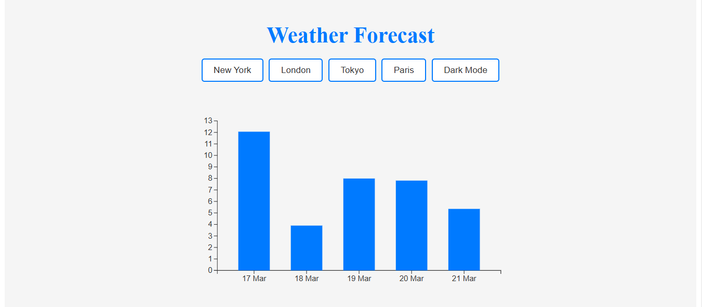

# Weather Forecast Visualization

This project is an interactive weather forecast visualization built using React and D3.js. It fetches real-time weather data from the OpenWeatherMap API, transforms the data, and displays it in a bar chart. The chart is fully interactive, with features like tooltips, zoom/pan, and dark mode support.

## Features

### Interactive Bar Chart
- Built using D3.js and React.
- Displays temperature data for the next 5 days.

### Tooltips
- Hover over bars to see detailed temperature information.

### Zoom & Pan
- Zoom in/out and pan across the chart for better exploration.

### Dark Mode
- Toggle between light and dark themes.

### Dynamic Data Updates
- Fetch and display weather data for different cities.

### Responsive Design
- Works seamlessly across different screen sizes.

---

## Tech Stack
- **Frontend:** React.js
- **Data Visualization:** D3.js
- **Styling:** Styled Components
- **State Management:** React Context API (for dark mode)
- **API:** OpenWeatherMap API

---

## API Used

The project uses the OpenWeatherMap API to fetch weather forecast data.

### API Details:
**Endpoint:** `https://api.openweathermap.org/data/2.5/forecast`

**Parameters:**
- `q`: City name (e.g., "New York").
- `appid`: Your API key (sign up at OpenWeatherMap).
- `units`: `metric` (for temperature in Celsius).

### Sample Request:
```bash
https://api.openweathermap.org/data/2.5/forecast?q=New York&appid=YOUR_API_KEY&units=metric
```

**Response:**
- The API returns a 5-day weather forecast with 3-hour intervals.
- The data is filtered to display only the daily temperature at 12:00 PM.

---

## Setup Instructions

### 1. Clone the Repository
```bash
git clone https://github.com/swayam-2003/weather-forecast-visualization.git
cd weather-forecast-visualization
```

### 2. Install Dependencies
```bash
npm install
```

### 3. Add API Key
Sign up at OpenWeatherMap to get your API key.

Create a `.env` file in the root directory and add your API key:
```env
REACT_APP_OPENWEATHERMAP_API_KEY=your_api_key_here
```

### 4. Run the Project
```bash
npm start
```
The app will start on `http://localhost:3000`.

---

## Project Structure
```
src/
├── components/
│   ├── Chart.jsx          # D3.js chart component
│   ├── Tooltip.jsx        # Tooltip component
├── utils/
│   ├── fetchWeather.js    # Fetch weather data from API
│   ├── transformData.js   # Transform API data for visualization
│   ├── ThemeContext.jsx   # Dark mode context
├── styles/
│   ├── globalStyles.js    # Global styles
├── App.js                 # Main application component
├── index.js               # Entry point
```

---

## How It Works

### Data Fetching
- The `fetchWeather.js` utility fetches weather data from the OpenWeatherMap API.
- The `transformData.js` utility processes the data to extract daily temperatures.

### Chart Rendering
- The `Chart.jsx` component uses D3.js to render a bar chart.
- The chart is interactive, with tooltips and zoom/pan functionality.

### Dark Mode
- The `ThemeContext.jsx` provides a dark mode toggle using React Context API.

### Styling
- Styled Components are used for consistent and dynamic styling.

---

## Screenshots
### Light Mode


### Dark Mode
[Dark Mode Screenshot](image-1.png)

---

## Dependencies
- **React**: Frontend framework.
- **D3.js**: Data visualization library.
- **Styled Components**: For styling.
- **Day.js**: For date formatting.
- **OpenWeatherMap API**: For weather data.

---

## License
This project is licensed under the **MIT License**. See the `LICENSE` file for details.

---

## Acknowledgments
- **OpenWeatherMap** for providing the weather data API.
- **D3.js Documentation** for the amazing data visualization library.
- **React Documentation** for the frontend framework.

---

## Contact
For questions or feedback, feel free to reach out:

📧 **Email:** swayamvasudevnayak@gmail.com
🐙 **GitHub:** [swayam-2003](https://github.com/swayam-2003)

